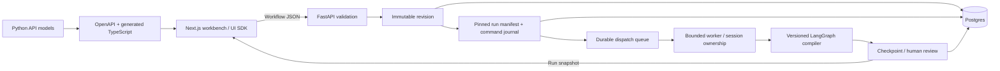

# Architecture

```mermaid
flowchart LR
  U[Next.js workbench / UI SDK] -->|Workflow JSON| A[FastAPI validation]
  A --> V[Immutable revision]
  V --> M[Pinned run manifest + command journal]
  M --> Q[Durable dispatch queue]
  Q --> W[Bounded worker / session ownership]
  W --> C[Versioned LangGraph compiler]
  C --> R[Checkpoint / human review]
  R -->|Run snapshot| U
  V --> DB[(Postgres)]
  M --> DB
  R --> DB
  P[Python API models] --> O[OpenAPI + generated TypeScript]
  O --> U
```

The workflow document is the editing boundary. The server validates node IDs,
connections, supported node kinds, reachability, termination, and budgets. A run
receives its own immutable workflow snapshot; edits affect future runs only.
Layout coordinates never determine execution order.

## Foundation boundary

The first runtime supports a single connected chain of note, review, and finish
nodes. Notes record user-provided text; review uses a real LangGraph interrupt;
finish marks completion. These are development behaviors, not research agents.
The graph is compiled from the submitted document, not a separate hardcoded flow.

Postgres stores content-deduplicated revisions, immutable run inputs, command
receipts, and LangGraph checkpoints. Each run is reconstructed from its pinned
revision and compiler version. Session advisory locks serialize execution across
worker processes; a worker losing its lock connection also loses checkpoint write
access. Each graph step uses synchronous persistence, without a transaction held
across the invocation. The journal bridges the gap between accepted commands,
checkpoint writes, and HTTP acknowledgements. See [ADR 0002](decisions/0002-durable-runs.md).

Resume requests address the exact checkpoint and interrupt; retries cannot approve
a later review. API actions atomically enqueue commands and return HTTP 202 receipts.
Workers recover confirmed work after losing ownership, with bounded attempts and
a no-resend fence for uncertain provider requests. Pre-migration unfinished commands,
handled errors and restored jobs require explicit recovery. Paused reviews remain
paused. See [workers](workers.md) and [ADR 0011](decisions/0011-durable-workers.md).
External effects in future tool nodes still require their own effect journals;
checkpoints alone do not provide exactly-once network side effects.

Artifact references use content addresses (`sha256:<digest>`) in the manifest;
graph state contains only those IDs. The evidence desk stores bounded immutable
originals in Postgres, records provenance and claim relationships, and pins selected
evidence versions to a run. New inputs are checked against captured bytes; accepted
legacy manifests remain compatible. A valid hash establishes content identity, not
source correctness. See [evidence desk](evidence-desk.md) and
[ADR 0004](decisions/0004-evidence-provenance.md).

The service binds to loopback and requires an owner session for every private API.
See [owner access](owner-access.md). Browser drafts and retry IDs are scoped to the
owner/workspace; saved revisions and runs live in Postgres. Provider sign-in is a
separate boundary. Public hosting remains unconfigured.

Schema 0.2 adds typed structured control flow, qualified subgraph/loop invocation
paths, parallel reviews, durable execution budgets, and cancellation. Its compiler
is separate from the preserved v0.1 executor. See [structured workflows](structured-workflows.md)
and [ADR 0003](decisions/0003-structured-workflows.md) for semantics and limits.

## Next capabilities

- Complete retention, operational monitoring, off-machine recovery and measured
  hosting configuration before remote or multi-user use. Local workers, bounded
  admission, cancellation, owner access and verified backups are implemented.
- Build on source provenance and claim relationships to test hypotheses, record
  falsifiers and confidence, and trace numerical assertions into report prose.
- Put research/retrieval, synthesis, drafting, and editing behind independently
  testable node interfaces. Model keys and tool credentials remain server-side.
- Bound run cost, time, iterations, and concurrent tools. Instrument actual node
  events and artifacts, not hidden reasoning transcripts.
- Keep the graph editor, evidence desk, run inspector, and report/feedback views
  distinct. A giant canvas alone is not a usable research workspace.

The visual editor will define workflows rather than reverse-engineer arbitrary
Python source. Advanced code can become a registered, typed node with a deliberate
input/output interface; it is not submitted as executable code from the browser.
